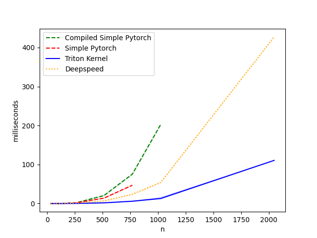
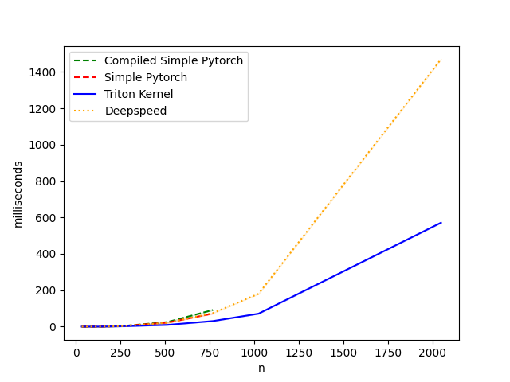

Fused Triangle Self Attention kernel, written in triton. Basically flash attention, but for triangle self attention. Implementation heavily inspired by FlagAttention and the triton fused attention tutorial.

- n^2 memory complexity (vs n^3 for pure pytorch).
- Faster (~2x) backward pass than next fastest implementation I could find (DS4S evoformer kernel).
- Faster (~5x) forward pass than next fastest implementation I could find (DS4S evoformer kernel).
- As far as I can tell, faster than naieve implementation.

Todos:
[] Add head dim to mask, so we can batch.
[] Add batch -> head and head -> batch if necessary.
[] Improve tests (e.g. larger scale, unittest on actual model values?)
[] Try to train a model with it.
[] Tune `_bwd_db`.
[] Make WARPS/STAGES/etc consistent in `scripts/tune.py`
[] Tune tries different dtypes, knows about cuda capability
[] Add tl.constexpr for HAS_MASK and DIVISIBLE, if statements where appropriate.
[] Can we perform and of dq/db/dkv transposed?
[] Can we fold delta pre-computation into e.g. db?
